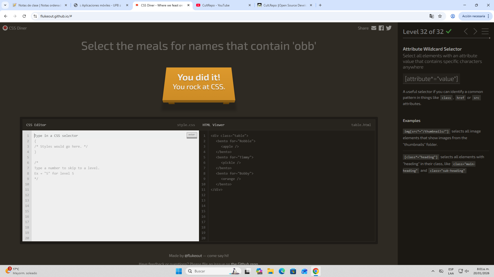

# Reto CSS Diner

## Evidencia reto completado

## Conclusiones

Los selectores CSS son usados para aplicar estilos de manera correcta y precisa en una página web. A través de esta primera práctica, se evidenció que no basta con conocer las propiedades de CSS, sino que se debe saber identificar correctamente los elementos a los que se desea aplicar cada estilo.

Los selectores básicos como los de tipo, clase (.) e id (#) son esenciales para comenzar a trabajar con CSS, ya que permiten diferenciar elementos de forma simple y ordenada.

Los combinadores permiten seleccionar elementos según su relación con otros dentro del HTML. Gracias a ellos es posible aplicar estilos dependiendo de la jerarquía del documento, como hijos directos, descendientes o hermanos generales o adyacentes.

Las pseudo-clases permiten seleccionar elementos según su posición o estado, como el primer o último hijo, o elementos específicos dentro de una lista. De esta manera, se pueden crear estilos más dinámicos sin necesidad de tocar el HTML.

Los selectores de atributos permiten trabajar directamente con las características de los elementos, lo cual se vuelve muy útil cuando se requiere seleccionar componentes de forma más específica sin agregar más clases.

De esta manera, se concluye que el aprendizaje de los selectores fortalece la capacidad para analizar la estructura del HTML y mejora la lógica para aplicar los estilos. A través de estos ejercicios se desarrolló una mayor comprensión de cómo funciona el DOM y se fomentó el uso de buenas prácticas en el diseño web, invitando a construir un código limpio y organizado.

---

### Desarrollado por

- Daniel Ortiz Aristizábal - 000186841
- Felipe Torres Montoya - 000524913

### Aplicaciones Móviles - Universidad Pontificia Bolivariana
