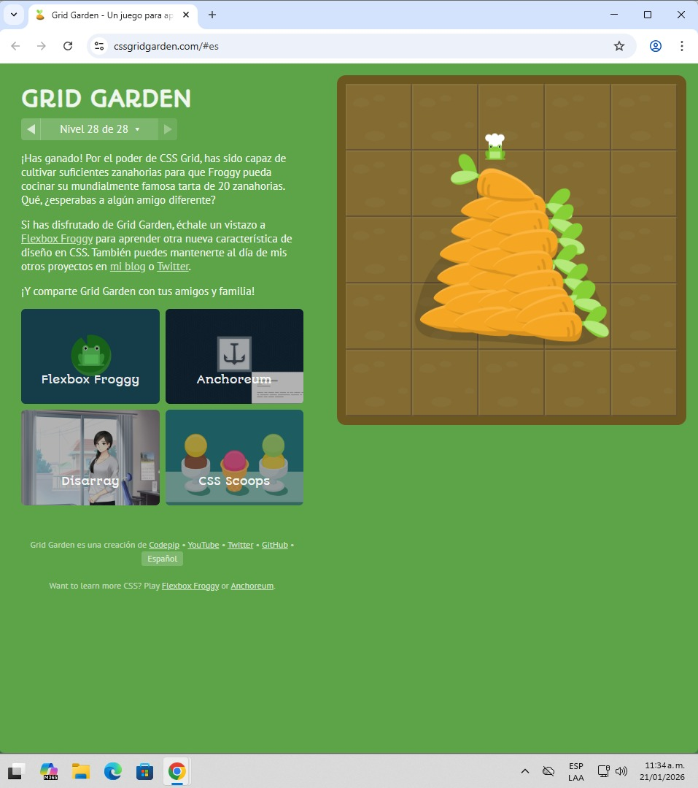

# Reto Grid Garden

## Evidencia reto completado

## Conclusiones

CSS Grid es un sistema de diseño bidimensional que permite organizar elementos en filas y columnas, ofreciendo un control más preciso sobre la estructura de una página web.

A través de los retos se aprendió el uso de `grid-column-start`, `grid-column-end`, `grid-row`, `span` y `grid-area`, los cuales facilitan la ubicación exacta de los elementos dentro de la cuadrícula.

La definición de la estructura mediante `grid-template-columns` y `grid-template`, junto con unidades como porcentajes, píxeles y `fr`, permitió distribuir el espacio de forma proporcional y flexible. En conclusión, CSS Grid fortalece el diseño de layouts complejos y ordenados.

### Desarrollado por

- Daniel Ortiz Aristizábal - 000186841
- Felipe Torres Montoya - 000524913

### Aplicaciones Móviles - Universidad Pontificia Bolivariana
