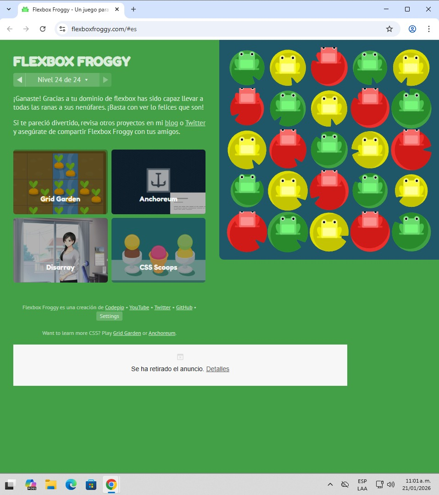

# Reto Flexbox Froggy

## Evidencia reto completado

## Conclusiones

Flexbox es un modelo de diseño que permite alinear y distribuir elementos de forma flexible dentro de un contenedor, facilitando la creación de interfaces adaptables y responsivas.

Durante los retos se comprendió el uso de `justify-content` y `align-items`, las cuales controlan la alineación en los ejes principal y secundario. Se evidenció que al trabajar en columnas, `justify-content` actúa de forma vertical y `align-items` de forma horizontal.

El uso de `flex-direction`, `order`, `align-self` y `flex-wrap` permitió modificar la orientación, el orden y la adaptación de los elementos sin alterar el HTML. En conclusión, Flexbox ofrece una forma eficiente y ordenada de estructurar el contenido.

---

### Desarrollado por

- Daniel Ortiz Aristizábal - 000186841
- Felipe Torres Montoya - 000524913

### Aplicaciones Móviles - Universidad Pontificia Bolivariana
