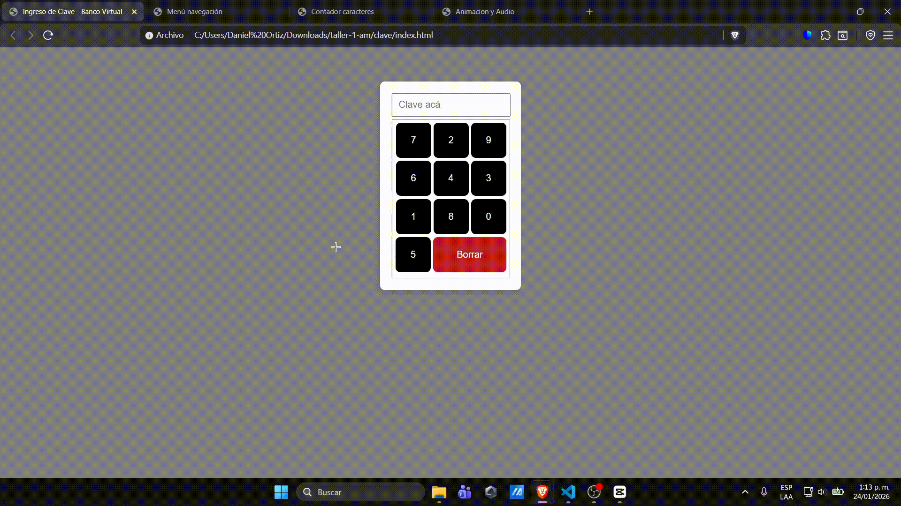
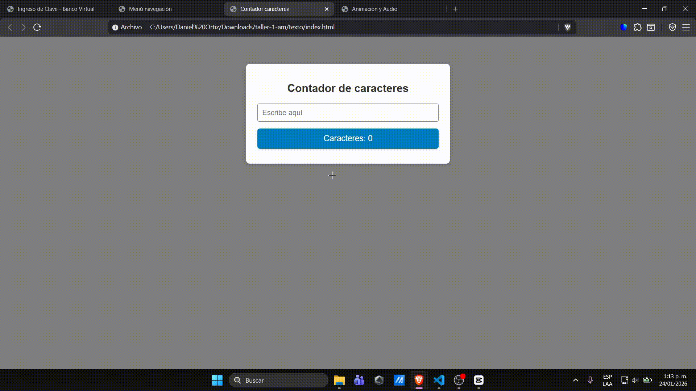

# Retos javascript

**Carpeta clave:**

- Ingreso de clave de la sucursal virtual de un banco con teclado

  

**Carpeta menu:**

- Menú navegación con scroll hacia una subsección de la misma pagina

  

**Carpeta anim:**

- Agregar animación y sonido a la escena de referencia

  

**Carpeta texto:**

- Desarrollar un campo de texto que muestre en tiempo real la cantidad de caracteres ingresados

  

---

### Desarrollado por

- Daniel Ortiz Aristizábal - 000186841
- Felipe Torres Montoya - 000524913

### Aplicaciones Móviles - Universidad Pontificia Bolivariana
